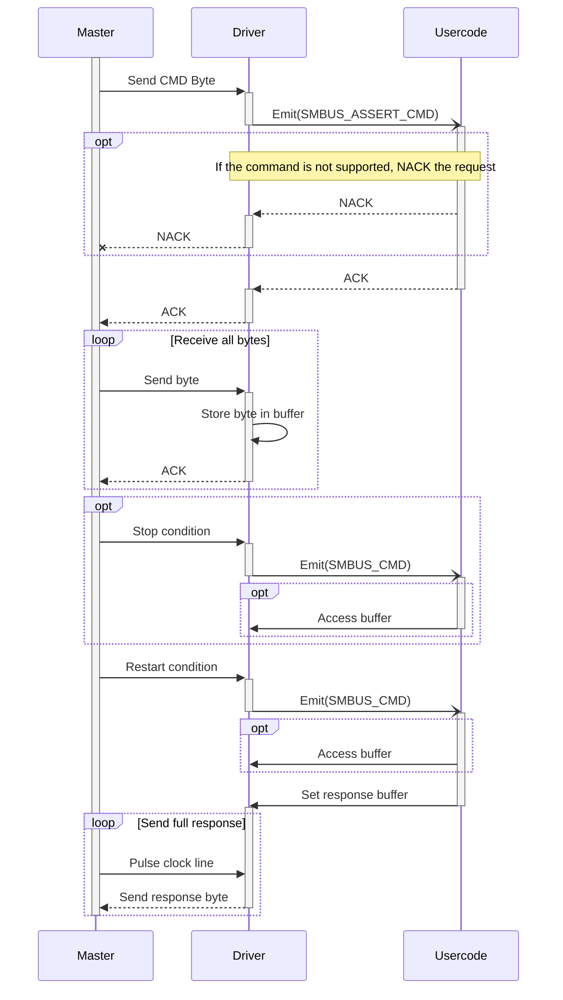

# MFM to Module communication

## Usercode events

| Event name       | Description                                                                             | Response                                               |
| ---------------- | --------------------------------------------------------------------------------------- | ------------------------------------------------------ |
| SMBUS_ASSERT_CMD | Fired after an addr match and CMD byte is sent                                          | Usercode should (N)Ack                                 |
| SMBUS_CMD        | Fired when all bytes have been received and the master sent a stop or restart condition | Usercode should process command and optionally respond |

## SMBus commands

| Command | Type       | Description                           |
| ------- | ---------- | ------------------------------------- |
| 0x10    | send byte  | Have the module perform a measurement |
| 0x11    | read block | Read the measurement results          |

## Internal

### TWI / I2C / SMBus

The idea is that the user code is only triggered in two cases:

- To ACK or NACK the sent CMD
  - Depending on whether it exists
- To process a received CMD
  - Triggered after stop or restart condition

That means it is not possible to NACK a received byte, or process the PEC byte. This is because the PEC byte cannot be distinguished from the other bytes, since the drive does not know the expected amount of bytes. (expected + 1 means the +1 is the PEC byte).

To implement PEC, the usercode should not only ACK/NACK after the `SMBUS_ASSERT_CMD` event, but also provide the amount of expected bytes. The driver can then take over and handle the PEC byte.

Note that the ATTiny814 has no CRC peripheral. Implementation is not difficult, but can it be sequential aka do we need to store the bytes or can we process one by one realtime? (https://forum.digikey.com/t/crc-basics/13455)

The PEC byte can occur in two occasions:

- **Master write with no read**  
  Means the master will end on the PEC byte, since CMD parameter length is known, the driver knows that the last byte is the PEC byte.
- **Master write, to read**  
  When reading, the driver knows the response length. If the master sends more clock cycles, the driver can provide the PEC. However, according to the specification (6.4.1.2.) the master should know whether the slave supports PEC.

#### Command sequence (no PEC)

