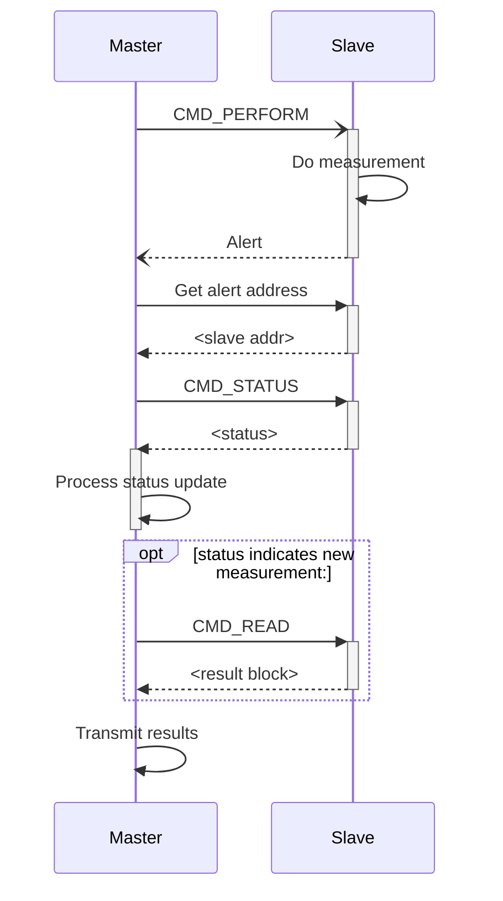

## SMBUS Alert

```mermaid
sequenceDiagram
  participant M as Master
  participant S as Slave

  M -) +S: CMD_PERFORM
  S ->> S: Do measurement
  S --) -M: Alert

  M ->> +S: Get alert address
  S -->> -M: <slave addr>

  M ->> +S: CMD_STATUS
  S -->> -M: <status>

  activate M
  M ->> M: Process status update
  deactivate M

  opt status indicates new measurement:
    M ->> +S: CMD_READ
    S -->> -M: <result block>
  end

  M ->> M: Transmit results

```
